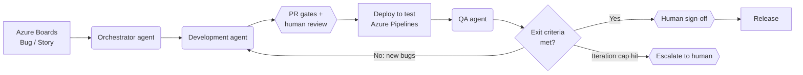

# Azure AI Automation — Agentic SDLC / STLC / DevOps Loop

An R&D blueprint for running the software delivery loop on Microsoft Azure with AI agents:

> A bug or user story is created in **Azure Boards** → an **Orchestrator agent** triages it → a **Development agent** fixes/builds it in **Azure Repos** and raises a PR → **Azure Pipelines** deploys to a test environment → a **QA agent** runs functional and non-functional tests and raises defects → defects go back to the Development agent → the loop repeats until the exit criteria are met → a human signs off the release.



## Try it now (no Azure account needed)

```bash
pip install pytest pyyaml requests openai anthropic azure-identity azure-functions
python -m pytest -q && python scripts/demo_local.py
```

The loop is implemented and tested end to end against an in-memory Azure DevOps and a real git worktree — see [docs/15](docs/15-implementation-status.md) for what runs, what was fixed in the blueprint, and what still needs a live tenant. To run the agents on your own repository: [docs/16](docs/16-project-adapters.md) and `python agents/local_loop.py --repo <path> --task "..."` (set `LLM_PROVIDER=anthropic` or `azure`).

## Start here

| If you want to… | Read |
|---|---|
| Understand the idea and scope | [docs/01-overview.md](docs/01-overview.md) |
| See every diagram (architecture, sequence, state machine, data flow) | [docs/02-architecture.md](docs/02-architecture.md) |
| Check what you need before you start | [docs/03-setup-requirements.md](docs/03-setup-requirements.md) |
| Build it step by step | [docs/04-setup-guide.md](docs/04-setup-guide.md) |
| Understand each agent's job, tools and prompts | [docs/05-agents.md](docs/05-agents.md) |
| Understand the loop, states and exit criteria | [docs/06-workflow-and-state-machine.md](docs/06-workflow-and-state-machine.md) |
| See how the QA agent tests (functional + non-functional) | [docs/07-testing-strategy.md](docs/07-testing-strategy.md) |
| Estimate cost | [docs/08-costing.md](docs/08-costing.md) |
| Security, governance, human-in-the-loop | [docs/09-security-and-governance.md](docs/09-security-and-governance.md) |
| Run a live demo for stakeholders | [docs/10-demo-guide.md](docs/10-demo-guide.md) + [demo/index.html](demo/index.html) |
| Plan the R&D phases | [docs/11-roadmap.md](docs/11-roadmap.md) |
| Risks, limitations and FAQ | [docs/12-risks-and-faq.md](docs/12-risks-and-faq.md) |
| Metrics and KPIs to prove value | [docs/13-metrics-and-kpis.md](docs/13-metrics-and-kpis.md) |
| Alternative: GitHub + Copilot coding agent | [docs/14-alternative-github-copilot.md](docs/14-alternative-github-copilot.md) |
| What is implemented and tested, and what changed from the blueprint | [docs/15-implementation-status.md](docs/15-implementation-status.md) |
| Point the loop at your repository (project adapter) | [docs/16-project-adapters.md](docs/16-project-adapters.md) |

## Repository layout

```
azure-ai-automation/
├── README.md
├── docs/                    # All design, setup, cost and governance documents
├── demo/
│   └── index.html           # Interactive simulation of the loop + cost calculator (open in a browser)
├── agents/                  # runner.py (tool loop), tools.py (sandbox), policy.py (diff gate), local_loop.py (run it locally), prompts/
├── orchestrator/            # engine.py (loop logic), llm.py (Azure OpenAI / Claude), fake_ado.py, Azure Function shell
├── tests/, */tests/         # ~100 tests: engine scenarios, sandbox, policy, pipelines, infra, full local loop
├── pipelines/               # Azure Pipelines YAML: dev-agent run, CI, deploy-to-test, QA-agent run
├── infra/                   # Bicep starter for the supporting Azure resources
└── scripts/                 # Helper scripts (Azure DevOps setup: tags, states, service hooks)
```

## Status

Implemented and tested locally; not yet run against a live Azure DevOps tenant (see docs/15). Prices, preview features and service limits change — every cost and capability statement in `docs/` has a "verify" note and a date. Last reviewed: **October 2026**.
