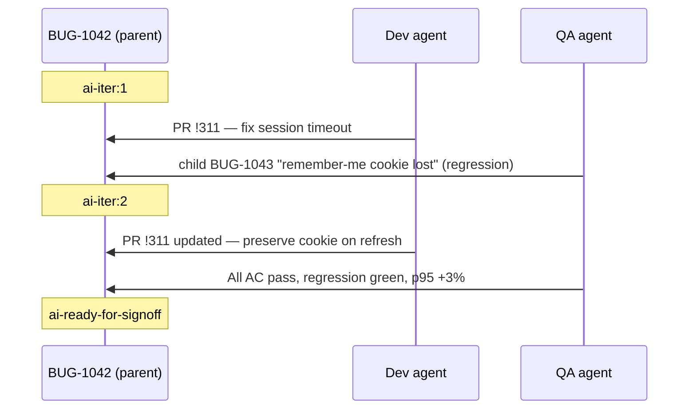

# 06 — Workflow, states and exit criteria

## Mapping logical states to Azure Boards (Agile process)

| Logical state | Boards state | Tags |
|---|---|---|
| Triage | New | `ai-loop`, `ai-owner:orchestrator` |
| NeedsInfo | New | `ai-needs-info` |
| InDev | Active | `ai-owner:dev`, `ai-iter:N` |
| InReview | Active | `ai-owner:dev`, `ai-pr-open` |
| InTest | Resolved | `ai-owner:qa` |
| Escalated | Active | `ai-escalated` (assigned to a human) |
| ReadyForSignoff | Resolved | `ai-ready-for-signoff` |
| Closed | Closed | — (human only) |

Using tags keeps the PoC on the stock process. Later you can create custom states in an inherited process.

## Routing rules (deterministic first)

| Event | Condition | Action |
|---|---|---|
| Work item created | tag `ai-loop`, type Bug/Story | Orchestrator readiness check |
| Readiness = ready | — | Set Active, `ai-owner:dev`, `ai-iter:1`, queue dev-agent |
| Readiness = not ready | — | Tag `ai-needs-info`, comment, assign to creator |
| Item updated | had `ai-needs-info`, updated by human | Re-run readiness |
| PR completed | linked to item | (deploy-test triggers from CI) |
| deploy-test completed | build contains linked items | Queue qa-agent for those items |
| QA created child bugs | parent `ai-iter:N`, N < cap | `ai-iter:N+1`, queue dev-agent with all open child bugs |
| QA created child bugs | N = cap | Tag `ai-escalated`, assign human, stop |
| QA verdict pass | exit criteria met | Tag `ai-ready-for-signoff`, notify release owner |
| Dev agent blocked | comment `blocked` | Tag `ai-escalated`, assign human |

## Exit criteria (all must be true)

1. Every acceptance criterion maps to ≥ 1 passing automated test.
2. No open child bugs of severity 1 or 2 linked to the parent.
3. Full regression suite green (allowing quarantined flaky tests listed in `tests/quarantine.txt`, which agents cannot edit).
4. Non-functional thresholds met (from `qa-thresholds.json`, owned by humans):
   - p95 response time ≤ baseline + 10%
   - error rate ≤ 1% under the standard load profile
   - no new High alerts in ZAP baseline
   - no new serious/critical axe-core violations on touched pages
5. Code coverage on changed lines ≥ 80%.
6. No new impacted defects: tests in modules touched by the diff all pass (change-impact analysis via changed files → mapped test tags).

## Loop guardrails

| Guardrail | Default | Why |
|---|---|---|
| Iteration cap | 3 | Agents can oscillate (fix A breaks B) |
| Dev inner retries | 4 build/test attempts | Stops runaway token spend |
| Token budget per item | e.g. 2M tokens | Cost ceiling; escalate when exceeded |
| Wall-clock budget per item | 4 hours | Prevents stuck items |
| Diff budget | 15 files / 600 lines | Large diffs need humans |
| Oscillation detector | Same test fails → passes → fails across iterations | Escalate immediately |

## Example: a bug through the loop

