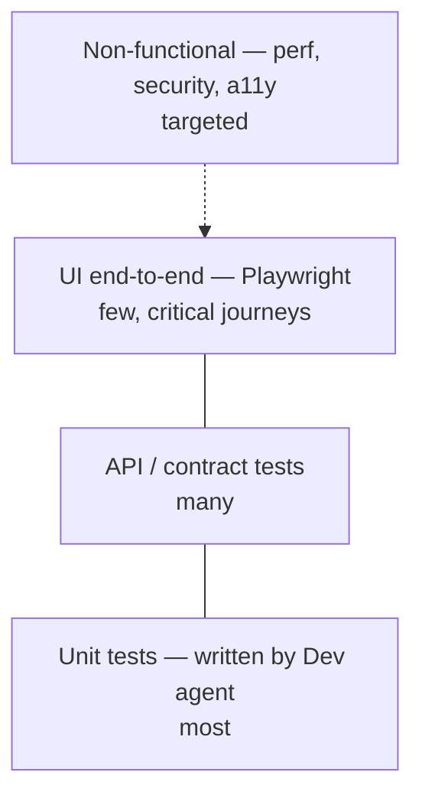

# 07 — Testing strategy (QA agent)

## Test pyramid the QA agent works with



## Test types

| Type | Tool | Who writes | When it runs | Pass rule |
|---|---|---|---|---|
| Unit | xUnit / JUnit / pytest (per stack) | Dev agent | PR build + dev inner loop | All pass, changed-line coverage ≥ 80% |
| Functional UI | Playwright | QA agent (new) + humans (regression) | qa-agent pipeline | All AC tests pass |
| API | Playwright `request` / REST client | QA agent | qa-agent pipeline | Status, schema and business rules hold |
| Regression | Existing suites | Humans (agents may add, never edit) | qa-agent pipeline | Green, excluding quarantine list |
| Change impact | Tag-mapped subset | — | Every iteration | All tests tagged for touched modules pass |
| Performance | Azure Load Testing (JMeter/Locust) | Humans own profiles; QA agent runs | Nightly + on items tagged `perf-sensitive` | p95 and error-rate thresholds |
| Security | OWASP ZAP baseline + SAST in PR | QA agent runs ZAP; SAST in CI | Every iteration (baseline), weekly (full) | No new High |
| Accessibility | axe-core via Playwright | QA agent | Touched pages | No new serious/critical |
| Exploratory | Agent-driven crawl | QA agent | Optional, time-boxed 10 min | Findings → bugs with evidence |

## How the QA agent derives tests from acceptance criteria

Input (Story AC):
```
Given an employee uploads a valid attendance Excel file
When the upload completes
Then the dashboard shows the new month's attendance within 5 seconds
And invalid rows are listed with the row number and reason
```

Agent output (plan JSON → generated Playwright tests):
```json
[
  {"id": "AC1-happy", "type": "ui", "steps": ["login", "upload valid.xlsx", "open dashboard"], "assert": "month visible", "timeout_s": 5},
  {"id": "AC2-invalid-rows", "type": "ui", "data": "invalid-3-rows.xlsx", "assert": "3 errors listed with row numbers"},
  {"id": "AC1-api", "type": "api", "endpoint": "POST /api/uploads", "assert": "201 + summary counts"},
  {"id": "AC1-boundary-empty", "type": "api", "data": "empty.xlsx", "assert": "400 with message"}
]
```

## Defect report template (created by QA agent)

```
Title: [AI-QA] <short symptom> — <page/endpoint>
Parent: #<parentId>   Iteration: <N>   Severity: <1-4>   Signature: <hash>

Steps to reproduce
1. ...
Expected
...
Actual
...
Evidence
- Playwright trace: <artifact link>
- Screenshot: <artifact link>
- Log excerpt (≤ 20 lines)
Test: tests/ai-generated/<parentId>/<file>::<test name>
Environment: test, build <buildNumber>
```

## Severity rules

| Severity | Rule |
|---|---|
| 1 — Critical | Data loss, security High, app down, core journey blocked |
| 2 — High | AC not met, regression in existing feature |
| 3 — Medium | NFR threshold breached by < 25%, a11y serious |
| 4 — Low | Cosmetic, a11y moderate, log noise |

Severity 3–4 bugs do **not** block exit; they are logged for human prioritisation.

## Flaky test handling

1. Failure → re-run once in isolation.
2. Passes on re-run → mark run as flaky in telemetry; no bug; 3 flaky events in 7 days → bug for humans to fix the test.
3. Environment errors (DNS, 502 on all endpoints, deploy not finished) → comment on parent, re-queue QA once, then escalate.

## Thresholds file (human-owned)

`qa-thresholds.json` in the app repo, protected path:
```json
{
  "perf": { "p95_ms_regression_pct": 10, "error_rate_pct": 1, "profile": "standard-50vu-5min" },
  "security": { "zap_max_new_high": 0 },
  "a11y": { "max_new_serious": 0, "max_new_critical": 0 },
  "coverage": { "changed_lines_min_pct": 80 }
}
```
