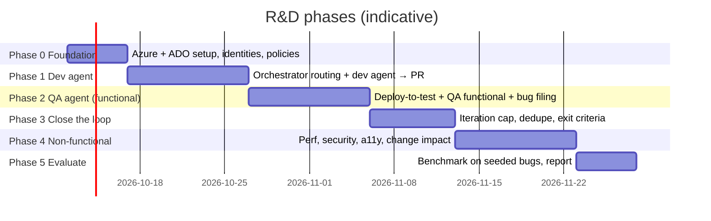

# 11 — R&D roadmap

| Phase | Deliverable | Done when |
|---|---|---|
| 0 Foundation | Infra deployed, ADO configured, models deployed | Smoke-test pipeline deploys SUT to test env |
| 1 Dev agent | Bug with tag → PR with fix + test | 5 of 10 seeded simple bugs produce a correct PR |
| 2 QA agent | Deploy → QA run → child bugs with evidence | QA agent finds a seeded regression and files a good bug |
| 3 Loop | Automatic re-assignment, cap, escalation | A seeded 2-iteration bug closes end to end |
| 4 NFR | Perf/security/a11y gates | Each NFR gate demonstrably blocks a seeded breach |
| 5 Evaluate | Metrics report (doc 13) + go/no-go | Report reviewed with stakeholders |

## After the PoC

- Custom states in an inherited process instead of tags.
- Self-hosted agents in a VNet for private test environments.
- Multi-repo changes, contract tests between services.
- Agent-proposed (human-approved) regression suite additions.
- Integrate with Azure Test Plans for traceability reports (if licensed).
