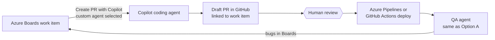

# 14 — Alternative: GitHub repo + Azure Boards + Copilot coding agent

If moving code to GitHub is acceptable, the Development agent becomes off-the-shelf.

## What changes

| Area | Option A (Azure Repos) | Option B (GitHub) |
|---|---|---|
| Dev agent | `dev-agent.yml` + runner + prompt | Copilot coding agent; repo-level **custom agent** file holds your dev rules |
| Trigger | Orchestrator queues a pipeline | Orchestrator (or a human) starts Copilot from the work item |
| Licences | Model tokens | Copilot Business/Enterprise seats + premium requests |
| QA agent | Unchanged | Unchanged |
| Orchestrator | Unchanged except dev routing | Unchanged except dev routing |

## Requirements

- Code in a GitHub repository connected to Azure Boards via the GitHub App.
- Copilot coding agent enabled on the repo; an eligible Copilot plan.
- Custom agents defined at repo or org level appear in Azure Boards when creating the PR.

## When to choose B

- The client already uses GitHub, or can move.
- You want to prove the QA-agent half of the loop quickly without building the dev runner.

## When to stay with A

- Azure Repos is mandated (common in government and regulated clients).
- You need full control of the model, region, prompts and logs.
